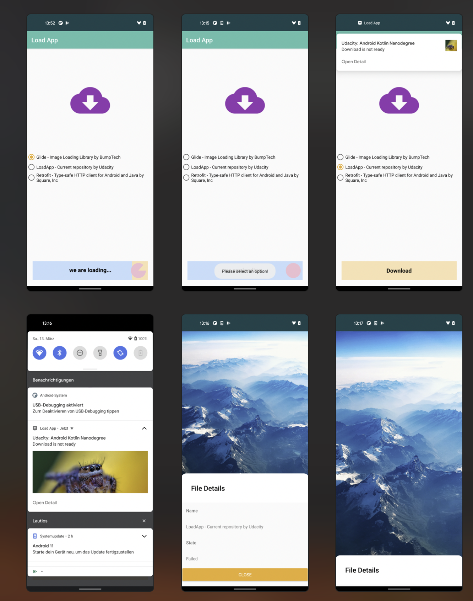

# android-load-app
Project for: Android Kotlin Developer Nanodegree Program - nd940 - project 3

# App Screen's 

<video width="296" height="640" controls autoplay muted>
  <source src="media/video.mov" type="video/mp4">
</video>

